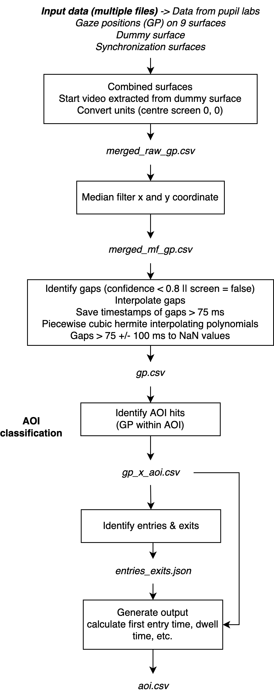
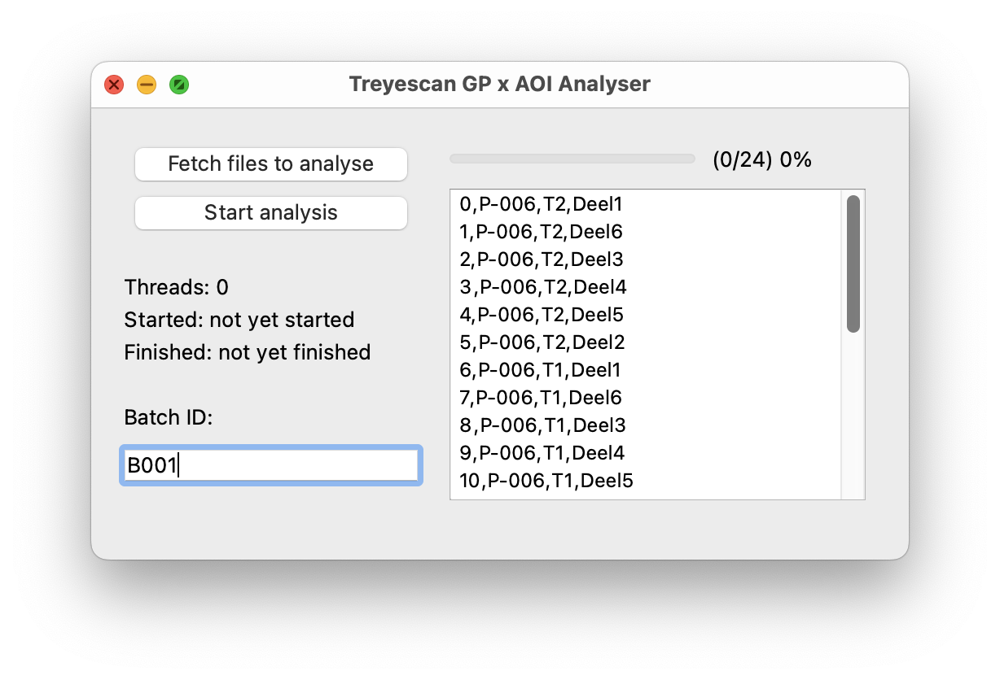

# This repository contains the code and Unity scenes for Thomas Skodje's 2024 Honors Thesis in Computer Science at Emory University

This project was developed as part of Thomas Skodje’s honors thesis in computer science during the spring of 2024 at 
Emory University. It is designed for use with the Pupil Labs Core eye-tracking device. The full thesis with 
more details can be found here: https://etd.library.emory.edu/concern/etds/5m60qt45z?locale=en

## File Structure
Unity Scenes contains the Practice Trial, First Trial, and Second Trial scenes in their respective folders.

Within Faraji's Dynamic AOI toolkit, apriltags/border_apriltags.py and AOI-selection/aoi_tracking.py are used to overlay apriltags on videos as well as track AOIs semi-automatically. The remainder of the toolkit was not used in this thesis, but was included for ease of access if future trials require additional portions of the toolkit.

my_data_analysis/main.py is the file used for running data analysis.
my_data_analysis/cleaned_files is where text file results from data analysis are placed. 

## Procedure for Administering Trials

In order to administer the trials, first obtain a participant’s consent to undergo the trials. Inform
them of the potential risks and benefits of undergoing the trial, and brief them on what they are
about to see in the trials. These trials are designed to test memory capabilities in patients with
epilepsy.

Start by having the participant put on the Pupil Labs Core eye-tracking headset, and have them
sit approximately 0.5 meters from the computer monitor (or any distance far enough to where
the entire computer monitor fits comfortably within the eye-tracking device’s scene camera).
Then, open the Pupil Capture software (included with the Pupil Labs Core device) and ensure
that the participant’s pupils are being correctly tracked by performing calibration.
After calibration is complete, open the “PracticeTrialPackage” package in Unity version
2021.3.16f1. 

Tell the participant to look at the cross fixation on screen when it appears, and
wherever they wish whenever a video is playing. Eye-tracking data from the practice trial should
not be recorded. The practice trial consists of a 4-second fixation followed by a 5-second video
clip, followed by another 4-second fixation, followed by a second 5-second video clip. Press play
on the Unity scene when the participant is ready.

After the participant completes the practice trial, open the “FirstTrialPackage” package in Unity
version 2021.3.16f1. Repeat the same instructions from the practice trial to the participant. Data
from this trial should not be recorded either. This trial consists of 15 alternating fixation and
video pairs (similar to the practice trial, except with 15 fixation-video pairs as opposed to 2).
Press play on the Unity scene when the participant is ready.

After the participant completes the first trial, open the “SecondTrialPackage” package in Unity
version 2021.3.16f1. Repeat the same instructions from the practice trial to the participant.
During this trial, eye-tracking data should be recorded using the Pupil Capture software. This
trial also consists of 15 alternating fixation and video pairs, but with the first, seventh, and
twelfth scenes having objects added. Press play on the Unity scene when the participant is
ready. Once the trial is completed, stop the recording and debrief the participant.
After the participant has completed all the trials and has been debriefed, use the raw data
exporter feature on Pupil Player to export the data from the participant’s recording to a .csv file.
Use the data processing toolkit, which can be found in this repository to process the data.

If you wish to upload any of your own videos or scenes to replace the default scenes in the
practice trial, first trial, and second trial, simply place your desired 5-second videos in the
“Videos” folder within each scene and update the data paths in the “play_vids” script in each
Unity project to reflect the new video names. Please note that videos longer than 5 seconds may be truncated or
produce errors.

## Data Processing Instructions

1.) obtain the file path of the participant's second trial video file that was generated by the Pupil Labs software.
2.) Navigate to the apriltags directory and run:
`python border_apriltags.py --name "path\to\pupil\video.mp4\file\here"`
with the appropriate file path to the participant's video file.
3.) Navigate to the AOI-selection directory and run:
`python aoi_tracking.py --video="insert\path\to\apriltags\video.mp4\here"`
with the appropriate file path to the video file generated during step 2.
4.) Locate the participant's gaze csv file (generated by Pupil Labs' raw data exporter plugin), and their AOI csv file (generated from step 3). You will need their file paths during step 5.
5.) Navigate to the my_data_analysis directory and run main.py. See results in a text file within my_data_analysis/cleaned_files


# This toolkit is an adapted version of Faraji's Dynamic AOI Toolkit. Below is the original README file from Faraji's toolkit.
Citation: Faraji, Y., & van Rijn, J. W. (2024). Dynamic AOI Toolkit v1.2.0 (v1.2.0). Zenodo. https://doi.org/10.5281/zenodo.10535707

# Dynamic AOI Toolkit v1.1

This toolkit includes tools to analyse Pupil Labs Core eye tracking gaze data in relation to dynamic areas of interest (AOI) on a wide screen. The tools included are: (1) AOI selector (both automatic and manual), (2) overlay AOIs and gaze on the task video, and (3) AOI hit detection.

## Table of Contents

1. [Installation](#installation)
1. [Task Preparation](#task-preparation)
1. [Usage](#usage)
   1. [Data Structure](#1-data-structure-data-folder)
   1. [AOI Selector](#2-aoi-selector)
      1. Method 1: Tracking objects semi-automatically
      1. Method 2: Selection AOI
      1. Combining the AOI Selector output
   1. [AOI Overlay](#3-aoi-overlay)
      1. Overlaying AOIS over a video
      1. Overlaying AOIS and gaze positions over a video
      1. Overlaying gaze positions of multiple participants and AOIs over a video
   1. [AOI Hit detection](#4-aoi-hit-detection)
      1. Analyze metrics such as dwell time, entry time etc.
      1. Merge outputs
   1. [Apriltags on video](#5-apriltags-on-video)
   1. [Screen analysis](#6-screen-analysis)
1. [Citation](#3-citation)
1. [Contribution](#4-contribution)
1. [License](#5-license)

## Installation

To use the toolkit, make sure python3 is installed. To install the latest version of this toolkit, use:

```bash
git clone git@github.com:treyescan/dynamic-aoi-toolkit.git

pip3 install -m requirements.txt
```

After that, make sure to copy `__constants.example.py` to `__constants.py` and change the parameters to your needs. Change the variable `data_folder` to point to the data folder as outlined [here](#1-data-structure-data-folder).

## Task Preparation

In order to use this toolkit, a task video must be prepared. Videos can be created in any video dimensions, resolution and frame rate. Just make sure to change the values for `total_surface_width`, `total_surface_height` and `frame_rate` in [\_\_constants.py](/__constants.py). The distance from eyes to screen: `distance_to_screen` and resolution of the screens: `ppi` should also be entered.

When preparing the task video, make sure to place apriltags on the borders of the video. `border_apriltags.py` can be used for this purpose ([5. Apriltags overlay on video](#5-apriltags-overlay-on-video)). The appearance of these apriltags marks the beginning of the task as the dummy surface in Pupil Capture. This should be defined in Pupil Capture.

Screen surfaces should also be defined in Pupil Labs Capture. The number of surfaces and the x-coordinate bounds of the surfaces can be entered in `__constants.py`. This information is necessary when combining the surface files to one gaze position file in [AOI Hit detection](#4-aoi-hit-detection).

Finally, we decided to put an apriltag in between each scene to track the synchronization. This should be a unique apriltag not used as one of the border apriltags. The surface on this apriltag can also be defined within Pupil Labs Capture. Make sure to note the beginning and ending frame number of appearance in [data/videos/start_end_frames/synchronization/task1.json](/data/videos/start_end_frames/synchronization/task1.json)

## Usage

### 1. Data structure (data folder)

- `data/`
  &nbsp;
  - `input-aoi/` – all files related to the AOIs
    - task1_aois.csv
    - _... (more aois)_
      &nbsp;
  - `input-gp/` – all files related to input data from Pupil Labs
    - [example-participant](/data/input-gp/example-participant/README.md)
    - P-001/
      - T1/ - measurement moment (one participant may perform the same trial more than once)
        - task1/
          - n surfaces from Pupil Labs
          - dummy surface from Pupil Labs
          - synchronization surface from Pupil Labs
          - gp.csv (generated by tools/analysis)
        - _... (more tasks)_
      - _... (more measurement moments)_
    - _... (more participants)_
      &nbsp;
  - `output/` – all output files
    - P-001/
      - task1/
        - number_of_filtered_rows.txt
        - gp_x_aoi.csv
        - entries_exits.json
        - outputfile.csv
      - _... (more task)_
    - _... (more participants)_
      &nbsp;
  - `videos/` – all videos
    - start_end_frames/
      - synchronization/
        - task1.json (this file contains start and end frame numbers of all synchronization surfaces)
        - _... (more tasks)_
    - task1.mp4
    - _... (more videos)_

### 2. AOI Selector

The AOI Selector allows the user to define dynamic AOIs. This can be done semi-automatically or manually. Both methods can be used simultaneously, after which the data files can be combined. We can check the data files by overlaying the csv files over a video in the [AOI overlay tool](#3-aoi-overlay).

#### Method 1: Tracking objects semi-automatically

```bash
cd tools/AOI-selection/
python3 aoi_tracking.py --video="video.mp4" --start_frame=100
```

**_Usage:_**

1. Run the command above, replacing `video.mp4` with the path to your video.
1. A few questions are asked, such as label of the tracked object and category. These are easily customizable in the script.
1. The video will open a preview screen.
1. If you want to select an object to track from the first frame, draw a box on the video.
1. If not: hit `[enter]` to play the video, hit `[s]` when you want to select an object.
1. The video starts playing and shows the tracked object. In this state, the results are directly saved to your output csv
1. When you're done, stop the script by hitting `[q]`.
1. Each AOI is outputted in a csv file with x and y coordinates of the AOI box in every frame. Additional information is given alongside each AOI, such as label and category.

#### Method 2: Selection AOI

```bash
cd tools/AOI-selection/
# use this to select  frames and let the script interpolate the frames in between
python3 aoi_selection.py --video="video.mp4" --start_frame=100

# use this to select each frame manually
python3 aoi_selection.py --video="video.mp4" --start_frame=100 --manual
```

**_Usage:_**

1. Run the command above, replacing `video.mp4` with the path to your video.
1. A few questions are asked, such as label of the tracked object and category. These are easily customizable in the script.
1. The video will open a preview screen.
1. If you want to select a AOI from the first frame.
1. If not: hint `[enter]` to play the video, hit `[s]` when you want to select a AOI.
1. The video starts playing **without** showing the AOI. when you want to select a new AOI, hit `[s]`.
1. When you're done, stop the script by hitting `[q]`.
1. The script will print the selected bounding boxes to the console and calculate the coordinates of the AOI in between.
1. The script will show you the computed AOI's by showing the video again and save it to the output file.
1. Every AOI is outputted in a csv file with x and y coordinates of the AOI box in every frame. Additional information is outputted alongside each AOI, such as label and category.

#### Combining the AOI Selector output

```bash
cd tools/AOI-selection/
python3 concat_files.py --folder data/testvideo
```

**_Usage:_**

1. Make sure all output files from script 1 and 2 are saved in one folder.
1. Run the command above, replacing `data/testvideo` with the path to your output folder.
1. The files will be concatenated to a single file (`combined_data/dataset.csv`). The console will show you the path of this file.

### 3. AOI Overlay

In AOI overlay, 3 tools are presented in order to view selected AOIs and gaze positions. The scripts overlay each frame of the task with information, depending on the chosen tool. Options include: only AOIs, AOIs + gaze of one participant and AOIs + gaze data of all available participants.

#### Overlaying AOIS over a video

```bash
cd tools/overlay/
python3 overlay_only_aois.py --video="video.mp4" --aois="aois.csv" --start_frame=1000
```

**_Usage:_**

1. Run the command above.
1. The video will be outputted to `video_with_labels.mp4` in the same folder.
1. Make sure to move this video before creating a new video.
   1. NB: video processing make take a while since every frame has to be processed at full resolution.

#### Overlaying AOIs and gaze positions over a video

```bash
# for one participant
cd tools/overlay/
python3 overlay_single_participant.py --video="video.mp4" --aois="aois.csv" --participant="{folder to participant}" --start_frame=1000
```

**_Usage:_**

1. Run the command above.
1. The video will be outputted to `video_with_labels_and_gaze.mp4` in the same folder.
1. Make sure to move this video before creating a new video.
   1. NB: video processing make take a while since every frame has to be processed at full resolution.

#### Overlaying gaze positions of multiple participants and AOIs over a video

```bash
# for multiple participants
cd tools/overlay/
python3 overlay_multiple_participants.py --video="video.mp4" --aois="aois.csv" --task="{folder of participants}" --start_frame=1000 --moment="T1"
```

**_Usage:_**

1. all `gp.csv` in {folder of participants} are fetched (last one).
1. output: `video_with_multiple_gp.mp4`
   1. NB: video processing make take a while since every frame has to be processed at full resolution.

### 4. AOI Hit detection



AOI hit detection provides a tool to calculate measures, such as dwell time and entry time. For every gaze position, the corresponding frame is checked for an AOI hit within the AOIs as defined by the AOI selectors. With `merge_outputs.py` the lastly generated output file of each participant is merged into one output file for statistical analysis purposes.

```bash
cd hit-detection
python3 analyse.py --p P-006 --mm T1 --t Deel1 --st 1

# to see what arguments we may provide
python3 analyse.py -h

# to run multi analysis on all P-* and all T* and all Tasks
# optional: provide the starting task for all analyses
python3 better-multi-analyse.py --st 1

# NB: the multi-analyse.py script can be used (which is slower – not multi threaded) when the GUI can't be opened
```



**_Usage:_**

1. Put the data in the appropriate data folder (see [Data Structure](#1-data-structure-data-folder)).
1. Make sure all other files are in place:
   1. data/videos/synchronization/task.json
1. Please check [\_\_constants.py](/__constants.py) for variables that can be adjusted to fit own research needs, such as `confidence_threshold`, `minimal_threshold_entry_exit`, `minimal_threshold_dwell` etc.

**_Parameters:_**

| Parameter                      | Unit | Description                                                                                                                                                                                                                                                       |
| ------------------------------ | ---- | ----------------------------------------------------------------------------------------------------------------------------------------------------------------------------------------------------------------------------------------------------------------- |
| `confidence_threshold`         | -    | Pupil Labs provides a quality assessment of the pupil detection for every sample, as a "confidence" value between 0.0 (pupil could not be detected) and 1.0 (pupil was detected with very high certainty). Values below this threshold are marked as gap samples. |
| `valid_gap_threshold`          | s    | Threshold for gaps to be filled in by linear interpolation. Gaps longer than this threshold remain gap samples.                                                                                                                                                   |
| `add_gap_samples`              | s    | The samples around a gap to be considered as additional gap samples, where the pupil of the eye may be partially occluded.                                                                                                                                        |
| `error_angle`                  | °    | Margin that is added around AOIs in degrees.                                                                                                                                                                                                                      |
| `minimal_angle_of_aoi`         | °    | A margin is added if AOIs are smaller than the `minimal_angle_of_aoi`, after that the margin of angle_a is added.                                                                                                                                                 |
| `minimal_threshold_entry_exit` | s    | If the time between an AOI entry and AOI exit is shorter than this threshold, these visits are combined as one visit.                                                                                                                                             |
| `minimal_threshold_dwell`      | s    | When the dwell duration is below this threshold, it will not be considered in total_dwell_time.                                                                                                                                                                   |

#### Merge outputs

```bash
cd hit-detection
python3 merge_outputs.py
```

**_Usage:_**

1. Make sure each participant folder has the file to be merged, as the newest output file in the folder.

### 5. Apriltags on video

This part of the TREYESCAN toolkit places apriltags at the borders of the task video.

### 6. Screen analysis

```bash
cd screen-regions
python3 analyse.py
```

#### Place apriltags

```bash
cd tools/apriltags
python3 border_apriltags.py --name="../videos/vid.mp4" --cols=8 --rows=2 --default-scale=3
python3 border_apriltags.py --name="../videos/vid.mp4" --cols=8 --rows=2 --default-scale=3 --large-scale=4 --large-scale-indices=0,5,6,11,12,13,14,15
```

**Usage:**

- `border_apriltags.py` can be run with different arguments:
  - name = 'name of video file', type=str
  - rows = 'number of apriltags on the y-axis', type=int, default=4
  - cols = 'number of apriltags on the x-axis', type=int, default=6
  - default-scale = 'scale factor for all apriltags', type=int, default=3
  - large-scale = 'scale factor for specific apriltags', type=int, default=3
  - large-scale-indices = 'indices of the apriltags to enlarge, split by comma', type=str, default=None
  - with-black-background = 'whether or not to add a black background behind the apriltags in the video', default=True
- In `/output` a video with apriltags and a png file with apriltag locations will be provided.

## 3. Citation

```
Faraji, Y., & van Rijn, J. W. (2022). Dynamic AOI Toolkit v1.0.0 (Version v1.0.0) [Computer software]. https://doi.org/10.5281/zenodo.8029272
```

- DOI v1.0.0: `10.5281/zenodo.7019196`
- DOI V1.1.0: `10.5281/zenodo.8029272`

## 4. Contribution

[Issues](https://github.com/treyescan/dynamic-aoi-toolkit/issues/new) and other contributions are welcome.

## 5. License

This toolkit is licensed under [GNU GENERAL PUBLIC LICENSE V3](/LICENSE)
